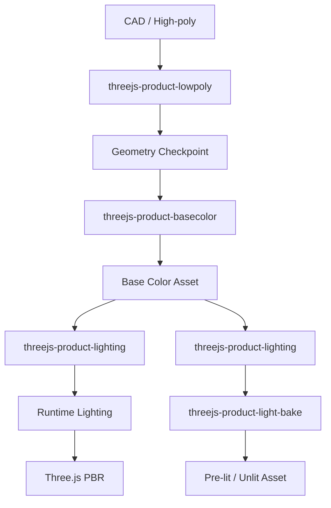

# Blender Three.js Product Skills

A collection of AI agent skills for preparing Blender product and machinery assets for real-time Three.js / WebGL applications.

These are not four unrelated prompts. Together they define a **Blender → Three.js Product Asset Pipeline** for turning CAD-derived, scanned, or high-poly product models into compact, documented assets for lightweight real-time visualization.

The collection is intended for:

- CAD models
- engineering machinery
- industrial products
- high-poly product models
- Blender assets intended for WebGL / Three.js
- lightweight real-time visualization on browsers, mobile devices, embedded displays, and VR hardware

## Skills

### 1. `$threejs-product-lowpoly`

**High-poly / CAD / scanned model → optimized low-poly real-time geometry**

Audits geometry before editing, removes low-value CAD features, cleans topology, rebuilds simple mechanical parts, and preserves the product silhouette, proportions, mechanical relationships, hierarchy, and animation pivots. It favors reconstruction, coplanar dissolve, and selective/local Decimate over a global Decimate pass.

The result is a geometry checkpoint suitable for later UV, texture, glTF, and Three.js work.

```text
Use $threejs-product-lowpoly to optimize the current Blender product model for Three.js.
```

### 2. `$threejs-product-basecolor`

**Approved geometry → clean UV → Base Color / Diffuse atlas**

Creates final UVs only after topology is stable and bakes the colors actually supplied by the source materials and textures. It keeps source and target UV maps explicit, controls atlas padding, and checks color bleeding under mipmapping.

Diffuse bake settings:

```text
Color:    ON
Direct:   OFF
Indirect: OFF
```

The texture contains no lighting, shadow, AO, specular, reflection, or environment lighting.

```text
Use $threejs-product-basecolor to rebuild UVs and bake a clean Base Color texture for the approved low-poly asset.
```

### 3. `$threejs-product-lighting`

**Neutral multi-angle product lighting → Blender lighting reference → Three.js runtime lighting strategy**

Builds scale-aware, balanced lighting for freely rotatable products. It checks multiple viewpoints, controls overexposed highlights and crushed shadows, preserves readable shape and curvature, and documents an equivalent Three.js runtime-lighting approach.

```text
Use $threejs-product-lighting to create neutral multi-angle product lighting suitable for Three.js.
```

### 4. `$threejs-product-light-bake`

**Base Color + Direct Diffuse Lighting + Indirect Diffuse Lighting → pre-lit texture**

Bakes approved scene lighting together with the actual source Base Color for lightweight, fixed product presentation. It addresses target UVs, atlas padding, shared-instance tradeoffs, frozen shadows, tone mapping, and double-lighting risk.

Diffuse bake settings:

```text
Color:    ON
Direct:   ON
Indirect: ON
```

This route supports stable cross-device appearance and low runtime lighting cost, including Unlit glTF or Three.js `MeshBasicMaterial` deployment where appropriate.

```text
Use $threejs-product-light-bake to bake Diffuse Color + Direct + Indirect lighting into the final presentation texture.
```

## Pipeline



See [docs/workflow.md](docs/workflow.md) for the detailed sequence and quality gates.

## Recommended delivery routes

### Route A — Runtime Lighting

```text
threejs-product-lowpoly
→ threejs-product-basecolor
→ threejs-product-lighting
→ glTF / GLB
→ Three.js runtime lighting
```

Use this route for freely rotatable models, moving components, changing lighting, PBR rendering, and higher visual fidelity.

### Route B — Pre-baked Lighting

```text
threejs-product-lowpoly
→ threejs-product-basecolor
→ threejs-product-lighting
→ threejs-product-light-bake
→ pre-lit texture
→ Unlit / MeshBasicMaterial
```

Use this route for industrial HMI, machine-control displays, embedded systems, low-power devices, fixed visual appearance, and predictable rendering across devices.

## Installation

### Codex skill installer

If your Codex installation includes the bundled skill-installer helper, install all four skills with:

```bash
python3 ~/.codex/skills/.system/skill-installer/scripts/install-skill-from-github.py \
  --repo doofly/blender-threejs-product-skills \
  --path skills/threejs-product-lowpoly \
         skills/threejs-product-basecolor \
         skills/threejs-product-lighting \
         skills/threejs-product-light-bake
```

The helper installs each directory into `~/.codex/skills/<skill-name>`. It stops if a destination directory already exists.

### Manual installation

```bash
git clone https://github.com/doofly/blender-threejs-product-skills.git
mkdir -p ~/.codex/skills
cp -R blender-threejs-product-skills/skills/* ~/.codex/skills/
```

Restart the relevant agent session or begin a new task so the installed skills are discovered.

## Repository layout

```text
blender-threejs-product-skills/
├── README.md
├── LICENSE
├── .gitignore
├── skills/
│   ├── threejs-product-lowpoly/
│   ├── threejs-product-basecolor/
│   ├── threejs-product-lighting/
│   └── threejs-product-light-bake/
├── docs/
│   └── workflow.md
└── examples/
    └── README.md
```

Each skill directory is self-contained. Keep its relative file structure intact when copying or installing it.

## Scope and safety

These skills target visualization assets rather than manufacturing-grade CAD, engineering validation, or cinematic hero models. Always retain the original source model and textures. Review geometry checkpoints before creating final UVs or baking textures.

No commercial product models, customer assets, Blender project files, or third-party textures are included in this repository.

## License

Released under the [MIT License](LICENSE).
